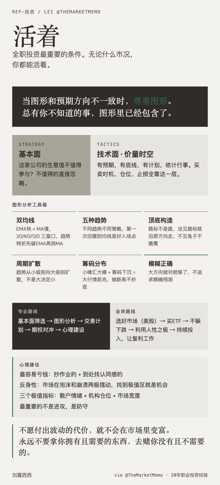

> 来源：[@TheMarketMemo（LEI）](https://x.com/TheMarketMemo/status/2035415988183957625)，基于他公开分享的 20+ 个视频的完整提炼。

---

## 投资是一门生意

LEI 同时做好几个"生意"——有的做长期持有，有的做交易，相互配合、相互对冲。他说全职投资最重要的条件就一个：活着。无论什么市况，你都能活着。

投资像种庄稼。春耕秋收，有季节。你不能今天播种明天要果实。美股每隔两年就来一次崩盘，再正常不过。最好的办法不是躲，是不要孤注一掷。

---

## 怎么分析一只股票

两层框架：

基本面是战略层——这家公司的生意值不值得参与？不值得的直接忽略。技术面是战术层——具体的买卖时机、仓位、计划。

他讲过一个亲身教训：曾经对一只股票的基本面非常了解，坚信自己没错、市场错了，硬扛了很久还逢低加仓。结果连续两个季度财报证明他看错了，管理层出了严重决策失误，而这些信息他无法从公开渠道及时拿到。惨败出局，那只股票至今没涨回他割肉的位置。

这件事之后他的原则：当图形和预期方向不一致时，尊重图形。总有你不知道的事，图形里已经包含了。

任何一笔交易：有预期，有底线，有计划，依计行事。

---

## 图形分析：价量时空

他认为绝大多数信息都反映在价格图形上。做不到先知先觉，至少后知先觉——学会看图。

四个维度：价格、成交量、时间、空间。

**双均线系统** — EMA（快）和 MA（慢）两条线配合。两线同向上行是牛市，同向下行是熊市。趋势转折一定先破 EMA，再引导 MA 拐头。他用 20、60、120 三个时间窗口。大牛市的启动信号：20天 EMA 先拐头向上 → MA20 跟上 → 60 均线组跟上 → 120 均线组跟上。

**五种趋势** — 不同趋势对应不同策略。多头趋势中，第一次回撤到 20、60、120 均线附近都是好入场点。判断工具是"抵扣价"——当前价高于均线抵扣价，均线就会继续上行。

**顶底构造** — 没见到顶底构造就不会见顶见底。这些构造是路标，不是路。出现路标不等于马上转向，但没出现就沿原方向走。做交易像猎手，不见兔子不撒鹰。

**周期扩散** — 他不同意"大周期决定小周期"。他认为趋势从小级别向大级别扩散——大周期的变化都是由小周期引起的。

**筹码分布** — 大行情发动前两个信号：小山峰汇聚成大山峰，筹码逐渐下沉。牛市是筹码在股价下方（下山，轻松），熊市在上方（上山，辛苦）。所以他很少抄底，更喜欢做接近新高的股票。

**模糊正确** — 不追求精确预测。他用 TSLA、AAPL、GOOGL 做过完整实战推演，核心：大方向做对就够了。

---

## 风险对冲

任何分析方法都有弱点。专业投资者必须了解期货和期权的对冲——不是为了赚更多，是极端情况下防止本金永久损失。

---

## 业余投资者的路径

不走专业路线也能赚钱，前提是在金矿里淘金，然后坚持投入，让复利工作。

选好市场。他认为美股最容易赚钱——持续的外部资金流入加上内部回购，供不应求。这两个结构不变，长期牛市就不变。

投资组合要有淘汰机制，不是买了就不动。

不要躲下跌。躲下跌也会错过上涨，错过上涨的代价远大于承受下跌。对大多数人来说，不择时、长期持有最容易赚钱。

利用人性之极。索罗斯的反身性：市场在泡沫和崩溃两极之间摆动。LEI 用三个指标找极值区：散户情绪、机构仓位、市场宽度。三者同时到极端时，就是最好的机会。

他自己的 Hi5 组合：五只 ETF，VTI 为核心，每年 Rebalance 一次，每月加投入。50 万加元起步，10 个月到 70 万。10% 复合回报率算，30 年接近 900 万。

ETF 是最实用的载体。他整理了三张观察表：权益类、结构类、美股细分行业。

---

## 心理建设

很多投资失败不是方法问题，是心理问题。

索罗斯的反身性：市场信息不完备，参与者的认知和偏见反过来影响市场，形成正反馈循环。价格不会在平衡点停下来，总是往两极跑。LEI 说他的交易理念大量来自索罗斯。

最容易亏钱的两类人。一类什么都不懂就抄作业，对了不知道为什么，错了也不知道。另一类有想法但不自信，到处找认同感，赚了归功自己，亏了怪别人。LEI 的建议：一定要有自己的逻辑，刚开始不成熟没关系，每次成败都在完善你的系统，积累够了会爆发。

几条他反复强调的：独立思考；买好生意；看懂波动而不是怕波动；不在人人乐观时以为自己是神；不频繁操作；耐心等机会；最重要的不是进攻是防守。

人天生对悲观故事更感兴趣，这是损失厌恶的本能。知道这一点之后，在困境中加一点乐观就够了。不愿付出波动的代价，就不会在市场里变富。永远不要拿你拥有且需要的东西，去赌你没有且不需要的东西。

---

