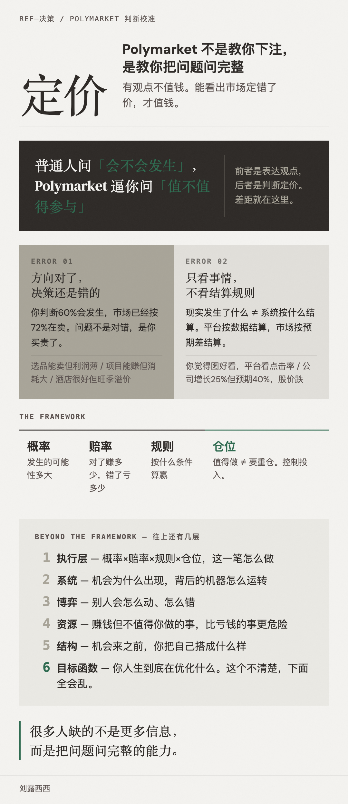

最近 Polymarket 这个词反复出现在我的信息流里。

王川老师提到它，说法很直接：如果一件事在 Polymarket 上概率低于 10%，先当不太可能；高于 90%，基本板上钉钉。顺手看一下交易量，金额太小参考价值有限。

他的用法是：看新闻、看分析时，顺手查一下 Polymarket，看市场怎么定价。很多人爱拿小概率事件制造情绪，看一眼市场概率，往往就清醒了。

巧的是同一天，播客《商业就是这样》也聊到 Polymarket，讲它为什么经常比评论更准。

我就决定认真搞明白它到底有用在哪。

---

## 不是下注，是训练定价能力

一开始我以为它就是个预测市场。看完发现，最有价值的地方不是下注本身，而是它逼你换一种问问题的方式。

普通人看问题，习惯问"会不会发生""对不对""好不好"。

Polymarket 逼你问的是：发生概率大概多少，市场现在怎么定价，这个价格还值不值得买。

前者是表达观点，后者是判断定价。有观点不值钱，能看出市场定错了价才值钱。

这也是为什么有些人平时分析头头是道，真做决定还是错。因为他有看法，但他没有把概率、价格、代价、资源占用一起放进判断里。

---

## 方向对了不代表决策对

你觉得一件事会发生，不代表买它就是对的。市场可能早就把这件事算进价格里了。

你判断某件事有 60% 概率发生，市场却已经按 72% 在卖——那问题已经不是"它会不会发生"，而是现在这个价格是不是已经太贵了。

放到现实里到处成立。

一个产品你直觉觉得能卖，但同款很多、广告越来越贵、利润只剩一点点、售后还很麻烦——那它就算能卖，也不值得你做。

一个项目确实能赚钱，但要熬夜、反复改需求、和低质量客户来回磨、做完也沉淀不下什么——"能赚钱"成立，"值不值得接"是另一回事。

一间酒店可能真的很好，但正好旺季、价格翻倍、你最近状态一般——"酒店很好"没错，"现在去住划不划算"要重新算。

输在方向上的人其实不多。更常见的是买贵了、成本算少了、节奏错了、投入太重了。

---

## 只看事情不看规则，是另一个坑

Polymarket 上有个硬教训：现实发生了什么，不等于系统按什么结算。

一个题目问"某公司会不会在某个时间窗里宣布一件事"，关键不在于它有没有做，而在于它有没有按题目要求"宣布"。

听起来像文字游戏，但现实里到处都是这种逻辑。

你觉得产品图好看、文案不错，平台不管——平台看点击率、转化率、停留时长、退货率。你以为自己在做审美，平台在按数据结算。

一家公司业务不错，增长了 25%。但市场原本预期 40%，股价照样跌。市场结算的不是"好不好"，而是"有没有超过预期"。

你觉得自己说得很清楚，对方那天情绪不好，理解偏了。你按"我说了什么"理解这件事，对方按"他感受到什么"来结算。

很多冲突和误判不是来自事情本身，而是你没搞清楚这个系统到底按什么算。

---

## 压成一个框架：概率 × 赔率 × 规则 × 仓位

- **概率**：这件事发生的可能性多大
- **赔率**：判断对了赚多少，错了亏多少
- **规则**：到底按什么条件算赢
- **仓位**：就算值得做，不等于要重仓

举个最简单的例子。一个市场里 YES 价格是 0.35，你判断它发生的概率大概 0.55。看起来被低估了。但你还不能直接冲——如果没发生最多亏多少？规则有没有看懂？就算有优势，值不值得下大仓？

走完这几步，你已经不是在猜对错，你是在做决策。

这四个词不只适合交易。选品、做内容、接项目、投资——本质上都是在回答同一组问题。

---

## 再往上还有几层

框架解决的是"这一笔怎么做"。但还有更大的问题。

这种机会为什么会出现？是平台规则制造了偏差，还是某类人会稳定地犯同一种错？搞清楚这个，你就不只是在做单笔判断，而是在看背后的机器怎么运转。

别人会怎么动？做热点内容，话题可能确实会火，但如果所有人都冲进去了，你就算判断对了，也未必轮得到你吃红利。

这件事值不值得占用我的资源？这里的资源不只是钱，还有时间、精力、注意力、机会成本。很多机会不是不赚钱，而是赚钱但不值得你来做。

为了长期接住机会，我该把自己搭成什么样？很多人以为抓机会靠临场反应，其实看的是你平时有没有结构——固定的信息源、稳定的判断框架、一套复盘方法、明确的风险边界。

最上面还有一个问题：我人生到底在优化什么。这个不清楚，下面全会乱。同一个机会，有人要钱，有人要自由，有人要安全感，有人要长期选择权。你最上面那层不同，后面的判断标准就都不同。

---

