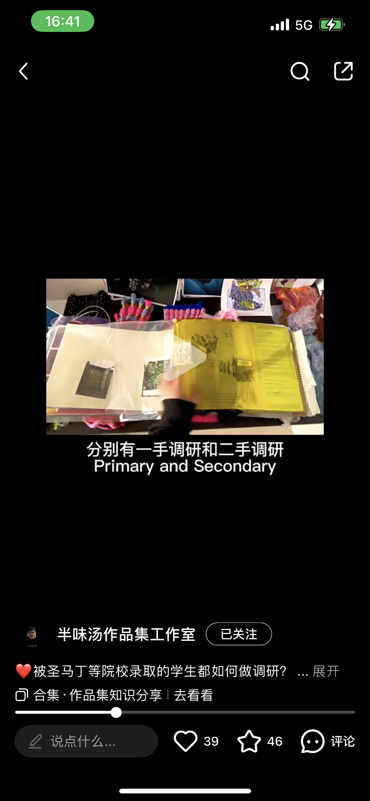
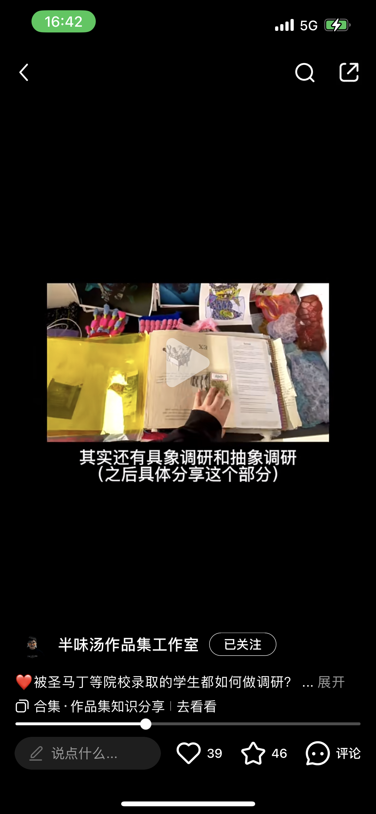
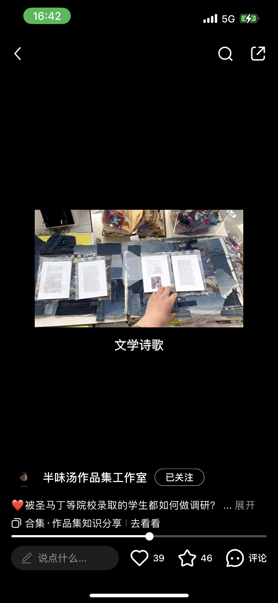
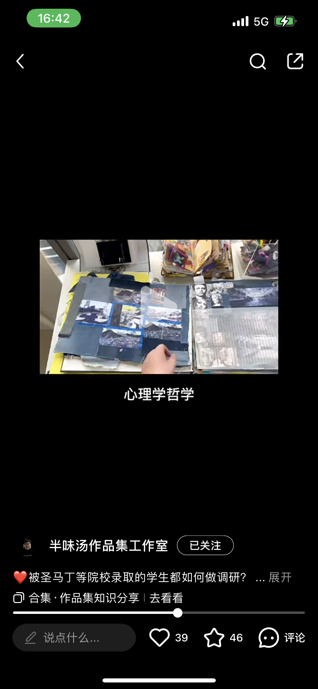
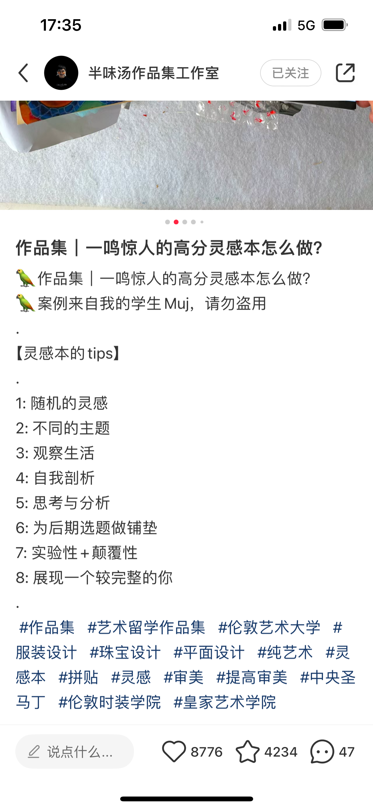
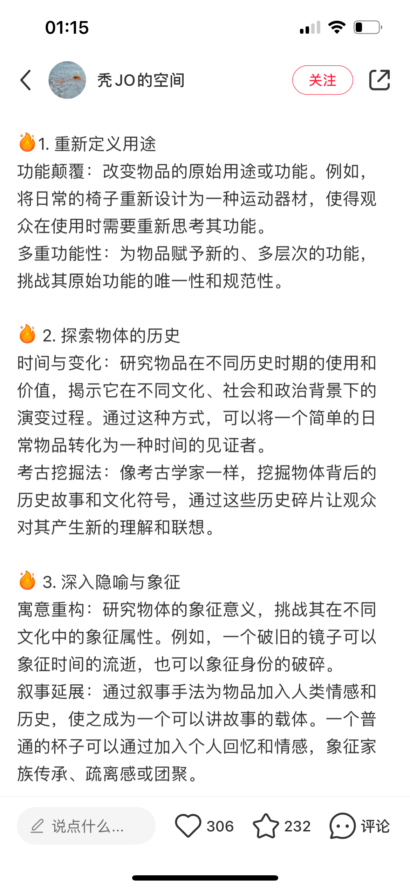
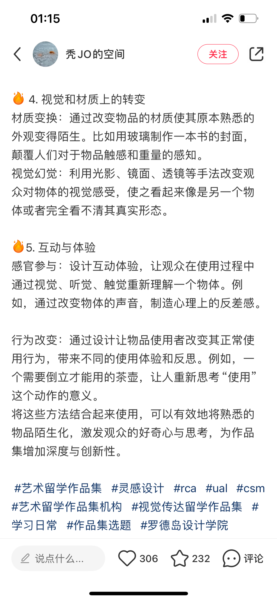
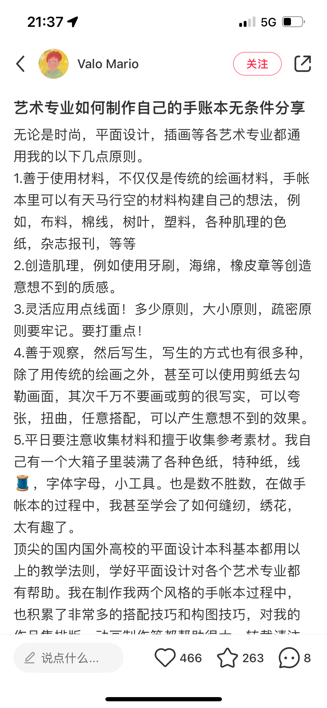

## 新版本各维度详细评分标准：

### 1. Enquiry（探究）

- 识别和分析相关的复杂问题和挑战
- 通过广泛的研究和调查来探索和评估解决方案
- 展示对实践、概念和理论的深入理解
- 将研究发现应用到实践中

### 2. Knowledge（知识）

- 展示对相关领域知识的全面掌握
- 能够批判性地分析和综合不同类型的知识
- 将理论知识与实践经验相结合
- 展示持续学习和知识更新的能力

### 3. Process（过程）

- 采用系统化的方法进行实验和探索
- 批判性评估过程中的方法和结果
- 能够适应和应对复杂和新兴情况
- 反思过程对最终成果的影响

### 4. Communication（交流）

- 清晰、准确地表达想法和概念
- 有效地传达创作意图和背景
- 展示对目标受众的理解
- 使用适当的方式和媒介进行沟通

### 5: Realisation (实现)

提升个人、专业和学术的制作标准。

