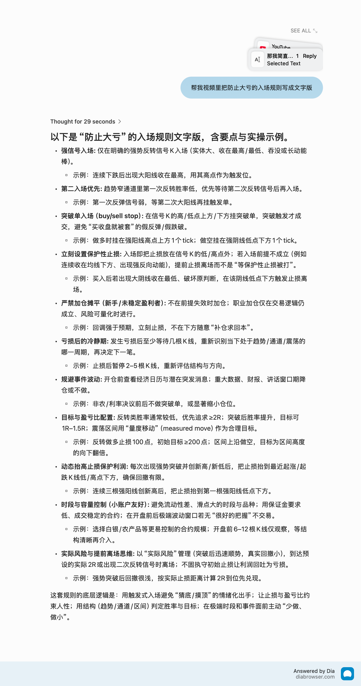

meme coin：

早上早起，审美选出最火的金狗，跟第一波，重仓赚到，跌了也有安全垫的

量比：

＜1就是缩量

＞1就是放量

＞或＝5就是巨量

低位+量比5以上 酝酿主升浪 拿稳了

高位+量比5以上 拉高出货

---

---

＜0.6严重缩量无主力无资金，短期无行情

0.9～1.5之间：没什么波动的区间，结合换手率看

1.5到2.5之间：温和放量，上升趋势中就继续拿，下跌趋势中大概率是反弹赶紧跑

2～5之间：强势放量，如果股价顶着关键压力位，量比也在走强，突破，持股

| **量比 (VR)** | **市场状态** | **5分钟K线位置** | **关键确认信号 (必须看)** | **修正后的操作策略** |
| --- | --- | --- | --- | --- |
| **< 0.6** | **僵尸盘** | 任意位置 | 股价波动极小 (心电图) | **绝对空仓**
港美股有很多这种缺乏流动性的票，进去了想出都出不掉（滑点巨大）。 |
| **0.8 ~ 1.5** | **震荡洗盘** | 箱体内部 | 股价在均线上下穿梭 | **观望**
除非你是做几分钱差价的剥头皮(Scalping)，否则不要参与。 |
| **1.5 ~ 3.0** | **健康攻击** | **上升趋势** | 股价沿着 **MA20** 或 **VWAP** 上方运行 | **持有/加仓**
这是最健康的日内拉升状态，不要轻易下车。 |
|  | **诱多反弹** | **下跌趋势** | 股价反弹触碰 **VWAP** 均线受阻 | **做空/离场**
这是经典的“回光返照”，在均线压力位放量滞涨，坚决卖出。 |
| **3.0 ~ 8.0** | **强力突破** | **压力位** | **大阳线**实体突破前期高点 | **追入 (Buy Stop)**
这是真突破。如果伴随 Level 2 只有买单没有卖单，胜率极高。 |
|  | **砸盘/洗盘** | **支撑位** | **长下影线** (探底回升) | **左侧试错买入**
这是主力在这个位置承接了所有抛压，博取反弹。 |
| **> 8.0** | **极端异动** | **高位加速** | 出现长上影线或十字星 | **立刻止盈**
量比过大说明多空分歧极其剧烈，往往是短线见顶信号（高潮即结束）。 |
|  |  | **低位暴跌** | 出现大阴线且无下影线 | **千万别接刀**
这说明还有更恐慌的抛盘在后面，甚至可能是重大利空消息泄露。 |

价格行为Price Action：

制定一个规则，必须要等待**强势的反转信号**
（甚至进一步，**只做第2次反转**，胜率更高）
在**强势信号K线的上方用突破单入场 stop market**
入场之后**在新的低点设置卖出止损**

币滚仓：全仓+止损设置好，100美金 3倍做多，浮盈加仓

- 10%单边趋势行情，二段滚仓
- 右侧追突破，浮盈加仓（跟踪止盈止损 chanclelier stop）
- 移动止损
- 两笔交易有一定距离 时间有一定间隔再加仓
- 金字塔加仓，越来越小