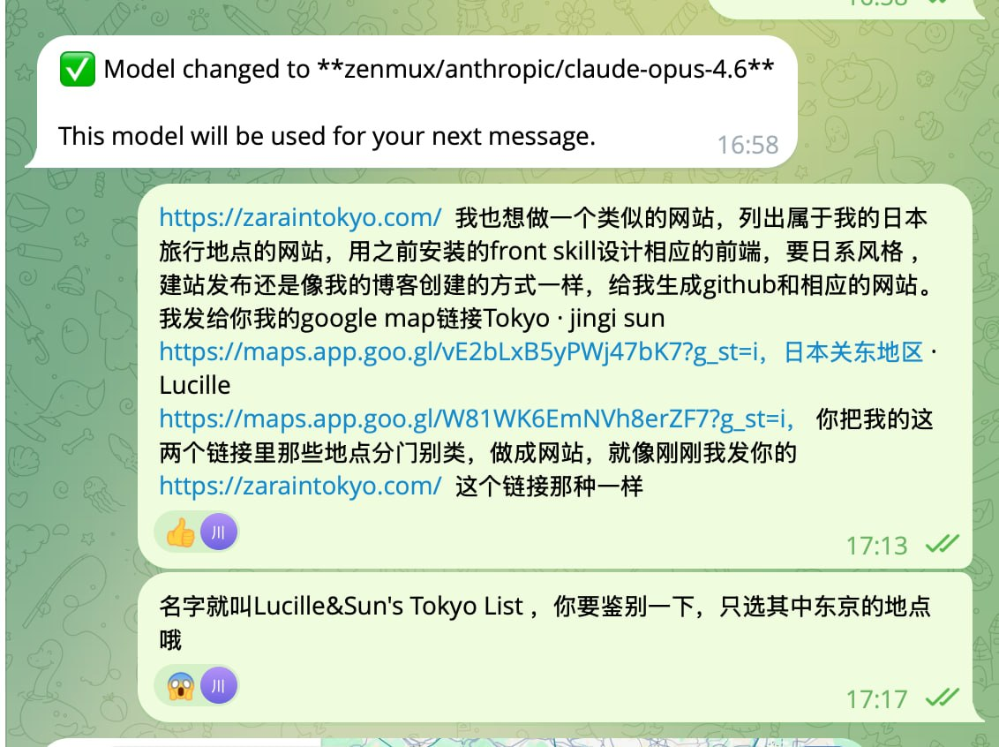
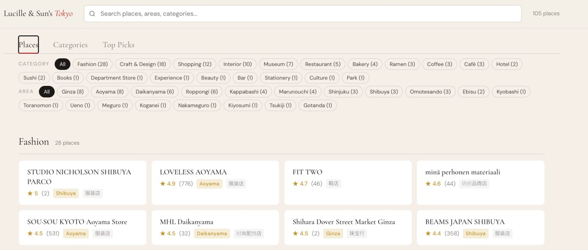
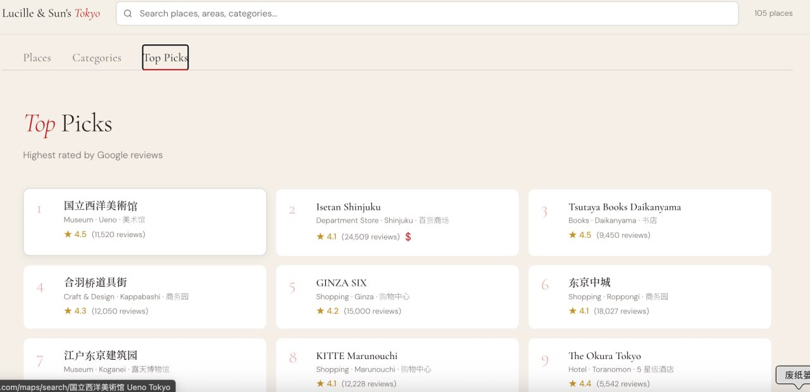
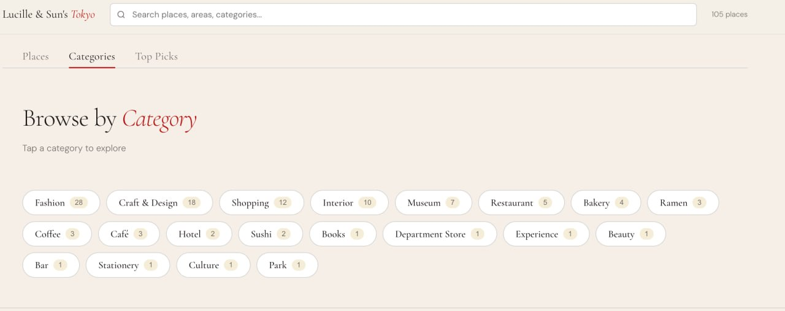

事情是这样的。

前几天刷到 Zara Zhang 分享了她做的一个网站，[zaraintokyo.com](https://zaraintokyo.com)，把她在东京喜欢的店，按区域、分类整理好了，点一下直接跳 Google Maps。

干净，清晰，实用。

我看完就一个念头：我也想要一个。

因为我手上刚好有素材。

我朋友 Sun 之前分享过她的东京 Google Maps 收藏给我，她审美很好，家居器物这块特别懂，逛的店多，选的地方基本可以直接抄作业。再加上我自己去东京时也攒了一份，两个列表合起来 111 个地点。

但你们知道 Google Maps 收藏列表的体验有多差吗。

不能分类，不能排序，不能筛选，分享给别人就是一堆 pin 钉在地图上，密密麻麻的，根本看不出哪些值得去。

---

## 所以我就跟我的 AI 说了一句

我用的是 OpenClaw，一个本地跑的 AI 助手。

我就发了这么两条消息：

大意就是，我有两个 Google Maps 列表，你帮我参考 Zara 那个网站的风格，做一个我们的版本，名字叫 Lucille & Sun's Tokyo List，只选东京的地点。

然后，它就开始干了。

抓数据，补评分信息，写网页，部署上线。

我全程没有打开任何开发工具。

---

## 三个小时后

成品长这样：**[lucilleandsun-tokyo.pages.dev](https://lucilleandsun-tokyo.pages.dev)**

105 个东京地点。20 个分类。可以搜索，可以按分类和区域筛选。

评分最高的 20 个，单独列了一个 Top Picks。

按分类浏览也很清晰：

每个地点点一下，直接跳到 Google Maps 导航。

配色是日系的和纸底色，字体搭配也很舒服，第一版出来我就觉得，嗯，就是这个感觉。

后面又来回说了几句"这里改一下""那个数字能不能点击跳转"，基本上每轮改完都是秒级响应。

---

## 整个过程我做了什么

说出来你们可能不信。

1. 发了两个 Google Maps 链接
2. 发了一个参考网站
3. 来回说了几句"这里改一下"

没了。

不需要写代码。不需要开 VS Code。不需要懂什么 HTML、CSS、JavaScript。

但我需要知道我想要什么——什么风格，什么功能，什么感觉。

这个是 AI 替代不了的。

---

## 如果你也想试

真的非常简单。

如果你有自己的城市收藏——Google Maps 的、大众点评的、小红书收藏的——想整理成一个干净的网页，自己用或者分享给朋友。

现在的 AI，真的可以直接帮你做。

你只需要说清楚三件事：参考什么风格、要什么功能、叫什么名字。

然后，就没有然后了。

越知道自己想要什么，出来的东西越好。

去试试吧。

---

网站：[lucilleandsun-tokyo.pages.dev](https://lucilleandsun-tokyo.pages.dev)

源码：[github.com/lucilleliull/lucille-japan-places](https://github.com/lucilleliull/lucille-japan-places)
