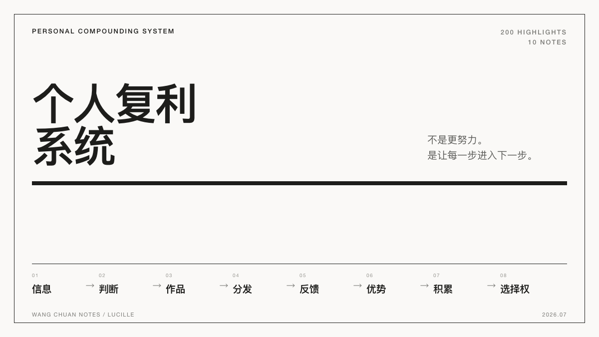
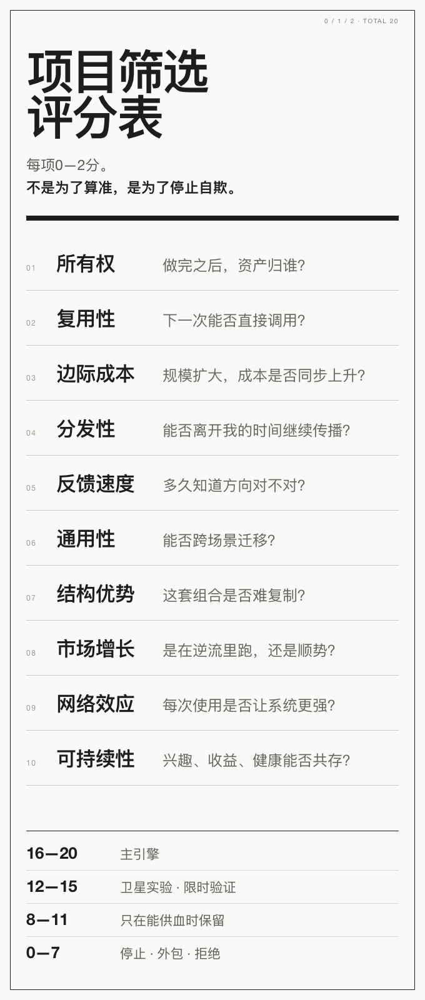

我重新翻了一遍自己在《王川宝典》里的记录。

200条划线。
10条个人想法。

看上去很散：财富、信息、读书、写作、创业、健康、创作、历史。

但压到最后，反复追问的其实是同一件事：

**我怎样不被低杠杆工作吞掉？**

答案也不是「更努力」。

而是把自己搭成一个可以持续复利的系统。

---

## 财富不是钱，是选择权

我划下过一句话：

> 「赚钱的本质是为了让自己增加选择权。如果增加选择权和赚钱发生冲突，选择权永远优于赚钱。」

钱只是选择权的一种存储形式。

它真正有价值，是因为能换来时间、信息、能力、网络和更好的机会。

所以判断一笔收入，不能只看赚了多少。

还要看它让我下一步的选择更多，还是更少。

有些钱看起来赚到了。

但它绑定了大量时间，增加了维护成本，消耗了健康，还把人锁死在低价值交付里。

这种钱可能正在减少财富。

---

## 真正值得做的，是会留下来的东西

我大量划线都围绕几个词：

**积累、储存、复用、组合、扩展。**

工作做完之后，最好能留下至少一种东西：

- 属于自己的产品
- 可重复使用的模板
- 真实需求和数据
- 方法论
- 品牌
- 客户或合作网络
- 可以继续升值的资产

一次性交付不是绝对不能做。

问题是做完之后什么都没留下。

下一次又从零开始。

看上去每天都很忙，系统却没有变强。

王川写：

> 「可积累、可持续积累、更快的持续积累、很难被破坏的更快持续积累。」

这里的顺序很重要。

先别急着追速度。

第一优先级是：**不要频繁归零。**

---

## 原创产品，才可能接上指数增长

我自己的几条想法，最密集地落在这里。

原创作品。
原创产品。
低边际成本。
进入更大的市场。

其中一条划线是：

> 「做那些制作成本低，边际成本低，分发成本低，通用性高，有长期价值的东西。」

这背后是一条增长闭环：

**原创资产 → 分发 → 收入和反馈 → 改进产品 → 提高通用性 → 进入更大市场。**

真正的敌人不是服务客户。

早期服务可以提供现金流、真实需求和训练数据。

真正的问题是：服务做了一百次，还是没有变成产品。

定制化不是原罪。

**无法产品化的定制，才是。**

---

## 信息系统，先于行动系统

重看划线后，我才发现，数量最多的其实不是「创业」。

而是信息。

信息源、信息成本、第一手资料、交叉验证、历史、人物传记、长期预测记录。

王川写：

> 「高价值信息的最大价值，在于第一时间把你从长期无效的『局部优化』中拉回来。」

这句话比「提高效率」重要。

方向错了，效率越高，浪费越大。

我的信息筛选标准可以压成四条：

1. 第一手信息优先
2. 看一个人多年前的预测记录，不看他现在说得多漂亮
3. 用不同来源交叉验证
4. 信息必须增加选择，不能只增加收藏

真正的信息优势，不是知道得多。

是能比别人更早停止无效行动。

---

## 阅读、写作、公开反馈是一条链

只读书，很容易变成新的消费。

这本书里最有用的一条循环是：

**真实问题 → 定向阅读 → 写出判断 → 公开测试 → 收集反例 → 修正模型。**

带着问题读，知识才会进入结构。

把判断写下来，模糊的直觉才会暴露漏洞。

公开之后，现实会给出反例、质疑和新的线索。

只读不写，知识没有整合。

只写不公开，缺少校验。

只公开不修正，就变成表演。

---

## 从做题家变成出题家

做题家在别人定义的标准里优化。

出题家定义问题、接口、评价标准和游戏规则。

我划过一句很狠的话：

> 「最好的赛道是只有你一个人能定义和参与的游戏。」

对个人来说，不一定要真的建立一个平台。

更现实的版本是：

- 定义一个独特问题
- 建立自己的判断和表达标准
- 把审美、经验、资源和分发方式组合起来
- 让客户因为这套组合来找你，而不是因为你更便宜

真正的结构性优势，通常不是某一项能力世界第一。

而是你的组合别人很难复制。

---

## 多领域不是原罪，没有主系统才是

我也在书里认真记录过「多任务还是聚焦」的问题。

王川强调不同元素的连接，强调慢速并行多个项目。

这很容易被误读成：摊子越大越有创造力。

不是。

有效的多项目必须满足三个条件：

- 项目之间共享资源
- 结果能够彼此回流
- 当前精力和现金流撑得住

对我更适合的结构是：

**一个主引擎，最多两个卫星实验。**

所有实验都必须向主引擎回流用户、内容、数据、技术或现金。

不能回流的项目，不叫组合性。

叫分心。

---

## 最需要警惕的，是那些听起来很漂亮的话

### 「指数增长的收获在曲线末端」

没错。

但它不能变成不止损的借口。

真正值得等待的项目，前期也应该出现一些领先信号：留存、复购、主动传播、生产效率提高、高质量资源开始流入。

长期什么都没有，不是「还没爆发」。

是没有正反馈。

### 「不能指数增长的事都不值得做」

太绝对。

关系、健康、信任、基本功未必指数增长，却是所有指数系统的底盘。

### 「大受众会自然产生商业模式」

不一定。

购买力、需求强度、信任结构和转化路径，比粉丝量更重要。

### 「选择权永远优于赚钱」

也需要现金流前提。

没有生存底盘时，现金本身就是最重要的选择权。

不要拿长期主义逃避销售和交付。

---

## 最后，压成一张项目筛选表

我把这200条划线压成10个问题。

每项0—2分，满分20分。

- **16—20分**：主引擎
- **12—15分**：卫星实验，限定验证周期
- **8—11分**：只有能给主引擎供血才保留
- **0—7分**：停止、外包或拒绝

这张表最重要的不是算出一个精确数字。

而是强迫自己承认：

有些事很有趣，但不值得现在做。

有些事能赚钱，但会吞掉长期选择权。

有些事暂时很小，却正在形成自己的结构性优势。

---

## 最小可行下一步

不是再收藏一条方法论。

是把现在所有项目放进评分表。

只保留：

- 一个长期拥有、可复用、可分发的主引擎
- 最多两个可以向主引擎回流的卫星实验

然后每周完成一次闭环：

**一个真实问题 → 一次定向阅读 → 一篇公开短文 → 一轮反馈 → 一次产品更新。**

这才是我从这200条划线里真正想留下的东西。

---

*本文来自我在微信读书《王川宝典》里的200条划线与10条个人想法。不是对全书的摘要，只是一次个人复盘。*
