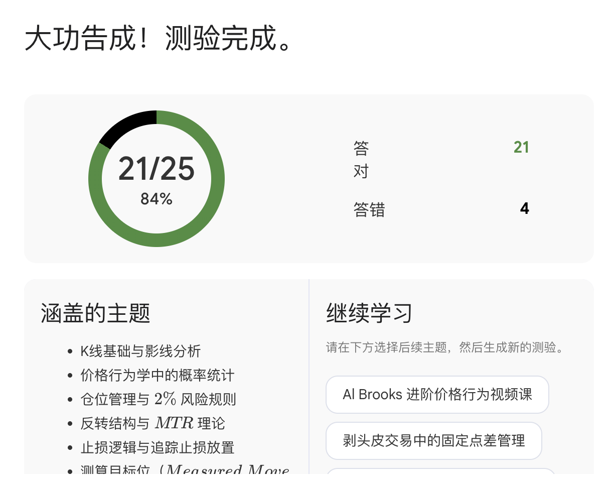

方方土，YouTube 上讲 Al Brooks Price Action 的中文频道。173 个视频，6 万多订阅。

正常看完？少说两周。

我花了三小时。

## 起因

之前装了一个 Chrome 插件叫 **YouTube to NotebookLM**。顾名思义——把 YouTube 视频一键导入 Google NotebookLM。

一直没怎么用。直到前两天想系统学一下 Price Action，打开方方土频道，173 个视频盯着我。

算了，试试那个插件。

## 第一步：一键导入

插件装好后，打开方方土频道页面，点一下。48 个核心视频，全部导入 NotebookLM，变成可检索、可对话的知识库。

整个过程大概两分钟。

48 个来源，全部到位。左边是视频列表，右边是 NotebookLM 的 Studio 面板——可以一键生成演示文稿、思维导图、闪卡、测验。

## 第二步：PPT 总览，先抓骨架

我做的第一件事不是开始读，是生成一份 PPT。

给了一句提示词：**"为这个内容做一份品牌化演示文稿，需参照 Google 品牌手册进行视觉设计与风格规范，图文并茂。"**

出来的东西超出预期。

Trading Range → Breakout → Tight Channel → Broad Channel。四个阶段，循环往复。

一份 PPT 翻完，整个体系的骨架就有了。不用记细节，先知道大地图长什么样。

这一步大概十五分钟。

## 第三步：思维导图，展开细节

骨架有了，接下来展开。

NotebookLM 自带思维导图生成。一点，整棵知识树铺开。

Al Brooks 的体系非常结构化——趋势判断、入场信号、止损逻辑、仓位管理，每个分支都能点进去看具体内容。

这一步不需要死记。看一遍，知道什么东西在哪里就行。后面忘了随时回来查。

## 第四步：对话提问，把不懂的问透

这是最值钱的一步。

NotebookLM 的对话功能，等于给你配了一个读完所有视频的私教。你问什么它都能从原始内容里找到对应的回答。

我问了很多问题。比如：

"推荐几个实战 Setup？"——它直接列出 High 2、Low 2 等经典入场模式，附带每个 Setup 的适用场景和注意事项。

不懂的地方反复追问。比如"Tight Channel 末期怎么判断突破方向？"、"什么情况下 Bar 的收盘价比影线更重要？"

**这种提问式学习，信息密度远超被动看视频。** 因为你问的都是你真正不懂的东西。

这一步花了最久，大概一个半小时。但也是收获最大的一个半小时。

## 第五步：测验自检

学完了，得验证。

NotebookLM 可以自动生成测验题。我让它出了几套。

25 道题，对了 21 道。84%。

错的那 4 道回去重新看了一遍对应内容。这比"我觉得我懂了"靠谱多了。

## 整个流程

拉通看一遍：

1. **导入**（2 分钟）— 插件一键导入 YouTube 频道到 NotebookLM
2. **PPT 总览**（15 分钟）— 先看骨架，不陷入细节
3. **思维导图**（20 分钟）— 展开知识树，建立索引
4. **对话提问**（90 分钟）— 针对性学习，把不懂的问透
5. **测验自检**（30 分钟）— 验证学习效果，查缺补漏

总计不到三小时。

## 学完什么感觉

说实话，三小时不可能精通。Price Action 这东西，真正的功夫在盘面上，在几百次实战里。

但入门了。

以前看 K 线图，只看到红绿柱子。现在能看到结构——趋势在哪个阶段、当前是突破还是回撤、该等还是该动。

最大的感受不是"我学会了 Price Action"，而是：**学习这件事的门槛被拉低了。**

173 个视频，以前想想就放弃了。现在三小时搞定入门。下次对什么好奇，同样的方法再来一遍。

这才是这套工具链真正值钱的地方。不是替你学，是让你敢开始学。

## 工具链

- [YouTube to NotebookLM](https://chromewebstore.google.com/detail/youtube-to-notebooklm) — Chrome 插件，免费
- [Google NotebookLM](https://notebooklm.google.com/) — 免费

方方土频道：[@LouiePriceAction](https://www.youtube.com/@LouiePriceAction)

## 附件

NotebookLM 生成的完整 PPT（PDF 版），可以直接下载翻着看：

📎 [Price Action Mastery — 完整演示文稿下载](Price_Action_Mastery.pdf)

去试。
