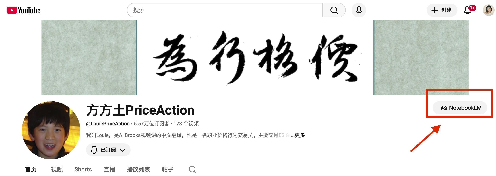
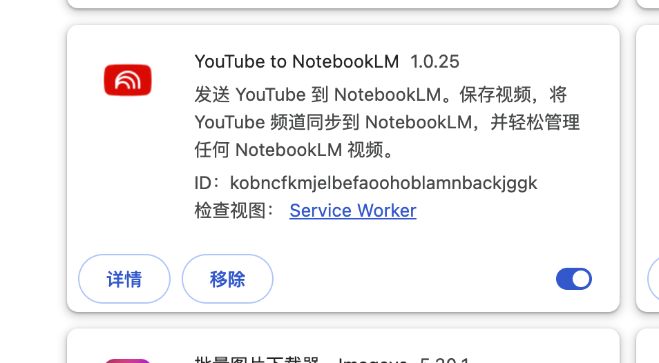
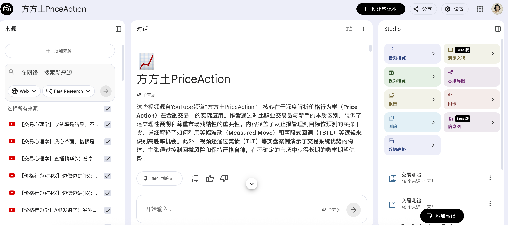
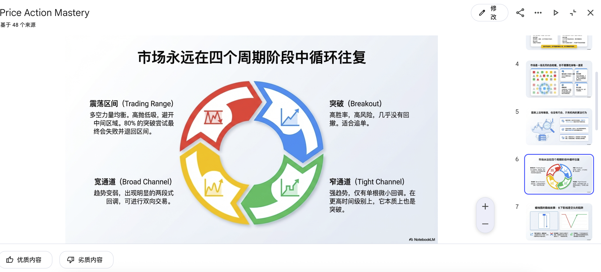
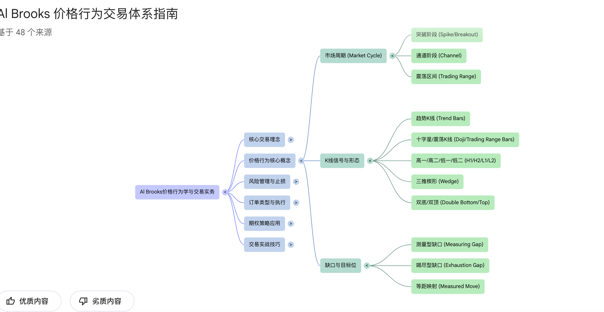
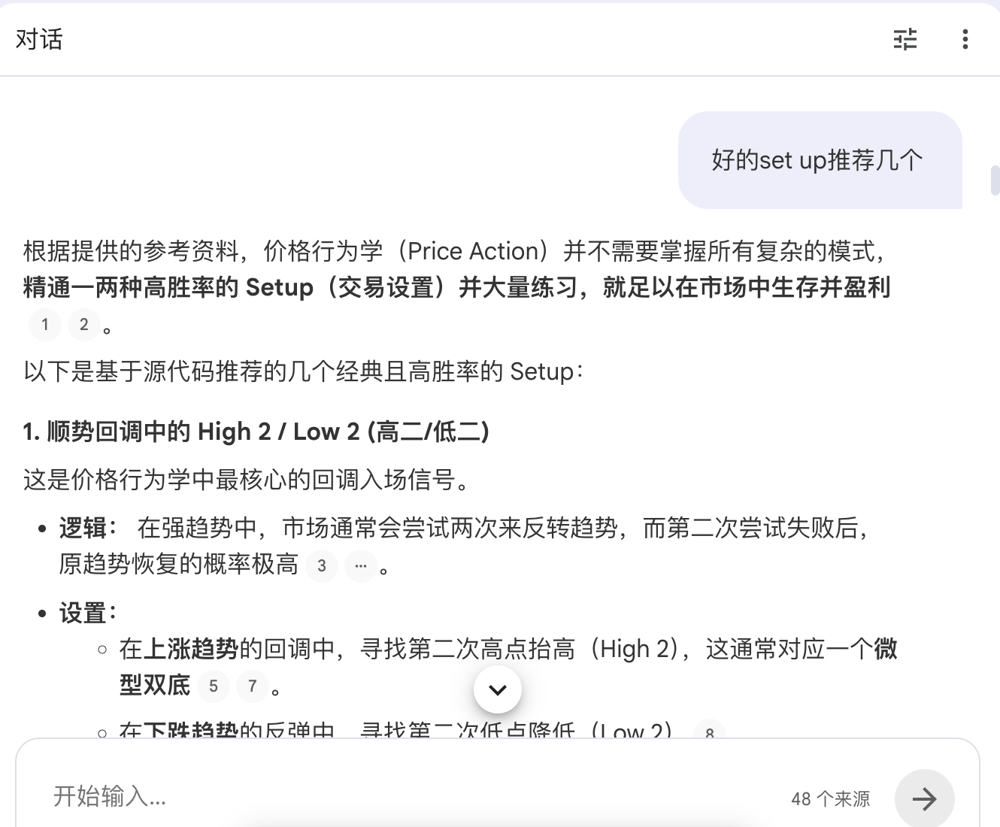
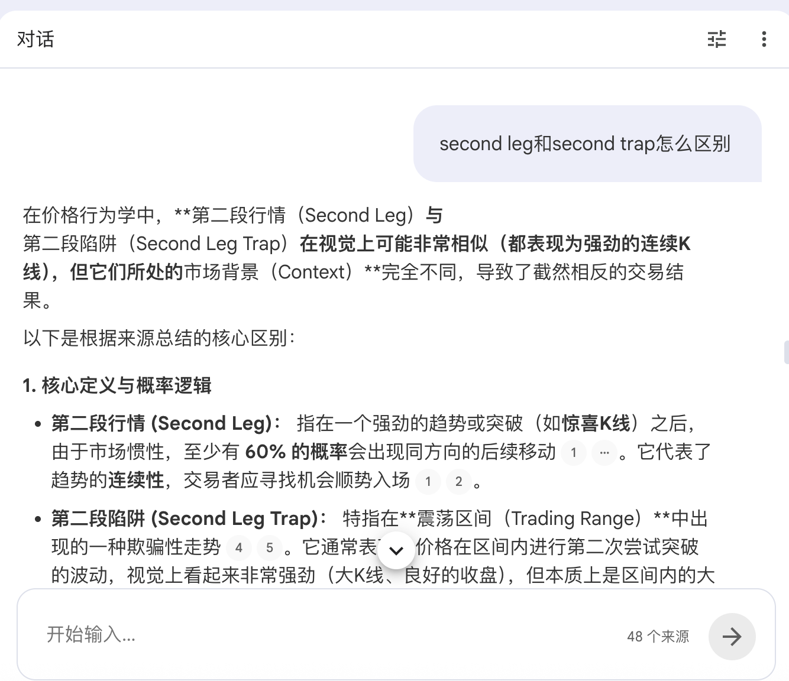
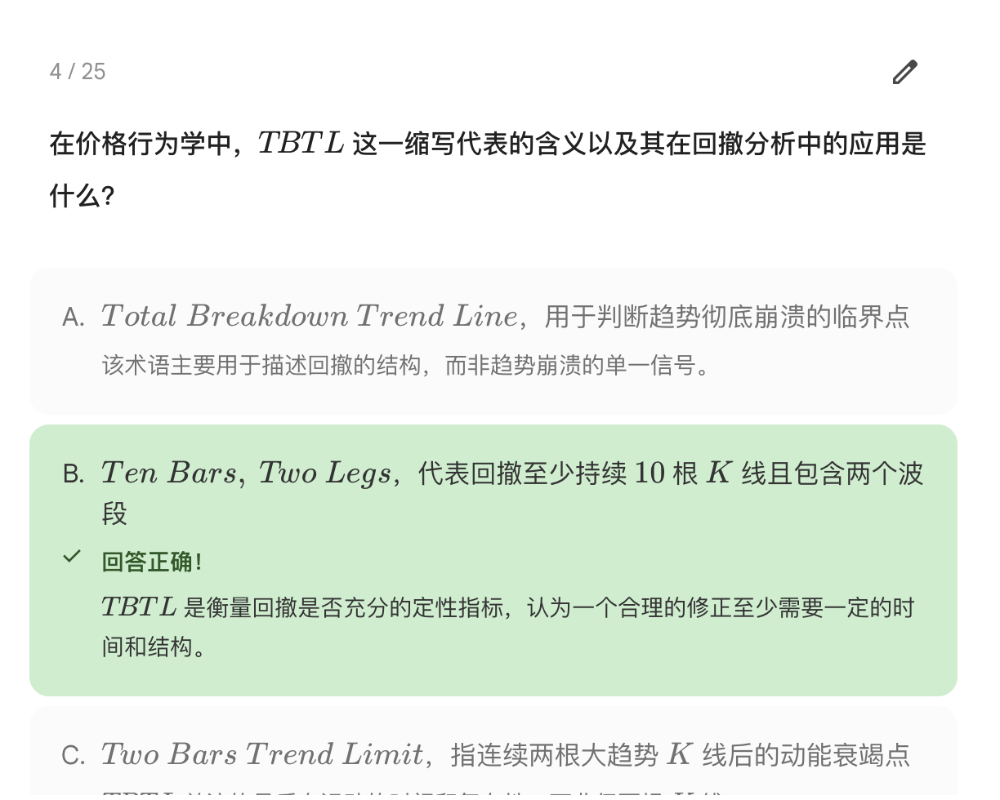
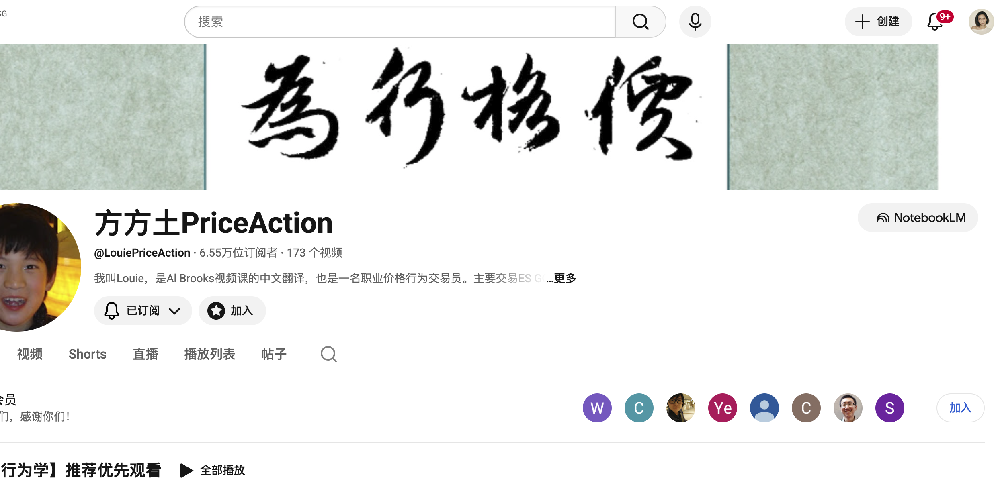

先说结论。

学习这件事，门槛被 AI 干掉了。

不是那种"效率提高 20%"的干掉。是从"想想就放弃"变成"三小时搞定入门"的干掉。

不管你是小学生、高中生、大学生、还是工作十年想转行的人——只要你对一个东西好奇，现在就能用 AI 把它拆碎了喂给自己。

学一门新技能？三小时入门。
考个证？快速通关，不浪费时间。
纯粹好奇一个领域？像玩游戏一样探索完。

学习不再是苦差事。它变成了满足好奇心的游戏。

我用一个实际例子给你看。

---

## 我学了什么

学委方方土。YouTube 上讲 Al Brooks Price Action 的中文频道。173 个视频，6 万多订阅。专业交易员，内容硬核。

正常看完？少说两周。

我花了三小时。

## 工具

一个 Chrome 插件：**YouTube to NotebookLM**。

顾名思义——把 YouTube 视频一键导入 Google NotebookLM。装好之后，打开任何 YouTube 频道，点一下，视频内容全部变成可检索、可对话、可出题的知识库。

免费。

## 第一步：一键导入

打开学委方方土的频道页面，点一下插件按钮。48 个核心视频，两分钟，全部导入 NotebookLM。

48 个来源，全部到位。左边是视频列表，右边是 Studio 面板——PPT、思维导图、闪卡、测验，随便生成。

## 第二步：PPT 总览，先抓骨架

我做的第一件事不是开始读。是生成一份 PPT。

给了一句提示词：**"为这个内容做一份品牌化演示文稿，需参照 Google 品牌手册进行视觉设计与风格规范，图文并茂。"**

出来的东西超出预期。

一份 PPT 翻完，整个体系的骨架就有了。不用记细节，先知道大地图长什么样。

十五分钟，骨架到手。

## 第三步：思维导图，展开细节

骨架有了，接下来展开。

NotebookLM 自带思维导图生成。一点，整棵知识树铺开。

每个分支都能点进去看具体内容。不需要死记，知道什么东西在哪里就行。忘了随时回来查。

## 第四步：对话提问，把不懂的问透

这是最值钱的一步。

NotebookLM 的对话功能，等于给你配了一个读完所有视频的私教。你问什么它都能从原始内容里找到答案。

不懂的地方反复追问。它不会不耐烦，不会觉得你笨，随便问。

**这种提问式学习，信息密度远超被动看视频。** 因为你问的都是你真正不懂的东西。

这一步花了最久，大概一个半小时。也是收获最大的一个半小时。

## 第五步：出题自测

学完了，得验证。

NotebookLM 可以自动生成测验题。你可以自己规定题目数量——少一点，每次不会太累。难度也能调。简单的先来一轮建立信心，难的再上。

错的题回去重新看对应内容。这比"我觉得我懂了"靠谱多了。

而且可以反复出题，不断测，直到真正掌握。

## 整个流程

拉通看一遍：

1. **导入**（2 分钟）— 插件一键导入 YouTube 频道到 NotebookLM
2. **PPT 总览**（15 分钟）— 先看骨架，不陷入细节
3. **思维导图**（20 分钟）— 展开知识树，建立索引
4. **对话提问**（90 分钟）— 针对性学习，把不懂的问透
5. **出题自测**（30 分钟）— 验证效果，查缺补漏

总计不到三小时。

## 不只是交易

这套方法跟学什么无关。

编程教程、设计课、语言学习、考证备考、历史纪录片、心理学讲座——YouTube 上任何系统性内容，都可以这样压缩。

核心就一句话：**让 AI 帮你建索引，用提问代替被动观看。**

被动看视频，信息留存率大概 10%。主动提问 + 出题自测，能到 60% 以上。

以前 173 个视频，想想就放弃了。现在三小时搞定入门。下次对什么好奇，同样方法再来一遍。

不是替你学。是让你敢开始学。

## 工具链

- [YouTube to NotebookLM](https://chromewebstore.google.com/detail/youtube-to-notebooklm) — Chrome 插件，免费
- [Google NotebookLM](https://notebooklm.google.com/) — 免费

学委方方土频道：[@LouiePriceAction](https://www.youtube.com/@LouiePriceAction)

## 附件

NotebookLM 生成的完整 PPT（PDF 版），可以直接下载翻着看：

📎 [Price Action Mastery — 完整演示文稿下载](Price_Action_Mastery.pdf)

去试。
